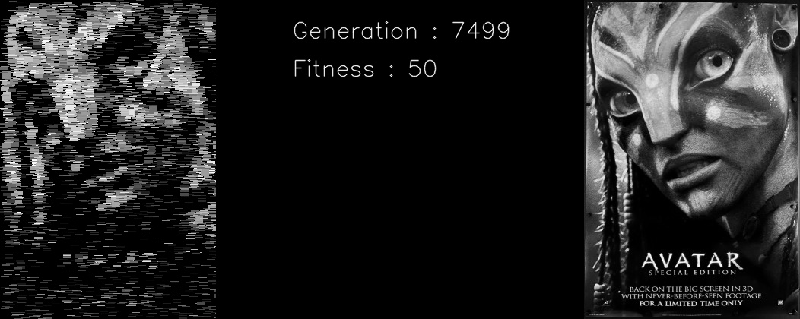
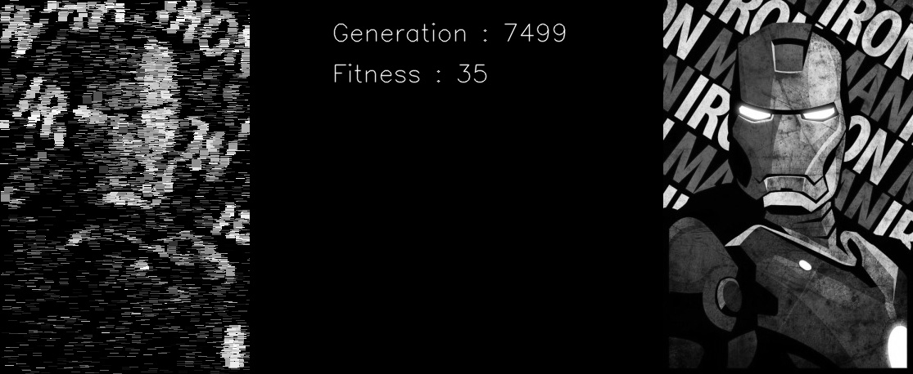
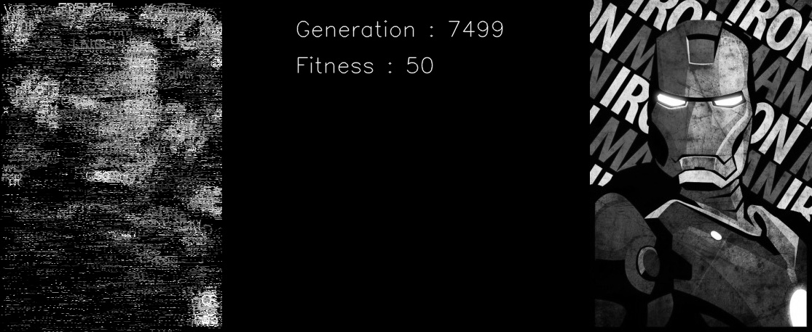

# Image Reconstruction using Genetic Algorithm

## Installation

```
pip install -r requirements.txt
```

## How to Run

```
python main.py
```

## Preview



<h5><center>Avatar Using Rectangles</center></h5>

```
```



<h5><center>Ironman Using Rectangles</center></h5>

```

```



<h5><center>Ironman Using Alphabets</center></h5>

```

```

Here, Peak signal-to-noise ratio (PSNR) used as fitness function to evaluate similarity of two images. Peak signal-to-noise ratio (PSNR) is a widely used metric for evaluating the similarity between two digital images. It measures the difference between the original and processed images, taking into account the amount of noise introduced during the process. PSNR is useful for evaluating the performance of image and video compression algorithms, as it provides a quantitative measure of the image quality. However, it has limitations, as it does not account for perceptual differences between images. Nonetheless, PSNR remains a valuable tool in the field of image processing, and is used in a wide range of applications including digital imaging, video coding, and multimedia transmission.
